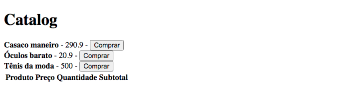

# Redux - Redux-Saga

This is a [rocketseat](https://www.rocketseat.com.br/) learning bonus to understand how works the Redux and Redux-Saga. This challenge help you improve your coding skills by building realistic application.

## Table of contents

- [Overview](#overview)
  - [The challenge](#the-challenge)
  - [Screenshot](#screenshot)
  - [Links](#links)
- [My process](#my-process)
  - [Built with](#built-with)
  - [What I learned](#what-i-learned)
  - [Useful resources](#useful-resources)
- [Author](#author)

## Overview

### The challenge

Users should be able to:

- Understand how Redux works
- Understand how Redux Saga works

### Screenshot



### Links

- Solution URL: [Github](https://github.com/gugavillar/studing_redux)

## My process

To create this application, i used the base to create a react app with the [create-react-app](https://create-react-app.dev/) with TypeScript template and install the [redux](https://react-redux.js.org/) and [redux-saga](https://redux-saga.js.org/)

### Built with

- ReactJS
- Typescript
- [React Redux](https://react-redux.js.org/)
- [Redux-Saga](https://redux-saga.js.org/)

### What I learned

In this project i was learn how to architecture flux works and how redux help us to implement a state what is work with all components, with his actions and reducers. Also i learned how to use the redux-saga to create a middleware to intercept the actions and request an api some data before call a new action

```js
export function addProductToCartRequest(product: Product) {
  return {
    type: ActionType.addProductToCartRequest,
    payload: {
      product,
    },
  };
}

export const cart: Reducer<ICartState> = (state = INITIAL_STATE, action) => {
  return produce(state, (draft) => {
    switch (action.type) {
      case ActionType.addProductToCartSuccess: {
        const { product } = action.payload;
        const productInCartIndex = draft.items.findIndex(
          (item) => item.product.id === product.id
        );

        if (productInCartIndex >= 0) {
          draft.items[productInCartIndex].quantity++;
        } else {
          draft.items.push({
            product,
            quantity: 1,
          });
        }
        break;
      }
      case ActionType.addProductToCartFailure: {
        draft.failedStockCheck.push(action.payload.productId);
        break;
      }
      default: {
        return draft;
      }
    }
  });
};
```

### Useful resources

- [React Redux](https://react-redux.js.org/) - This helped me for understand why use Redux.

- [Redux-Saga](https://redux-saga.js.org/) - This helped me for understand how Redux-Saga works.

## Author

- Twitter - [@gugacocao](https://twitter.com/gugacocao)
- Linkedin - [gugavillar](https://www.linkedin.com/in/gugavillar/)
